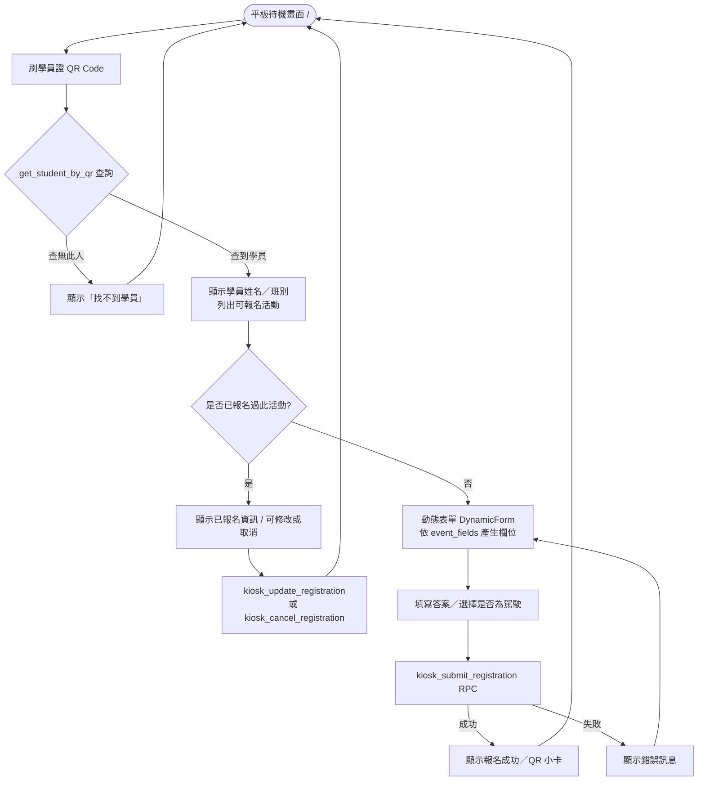
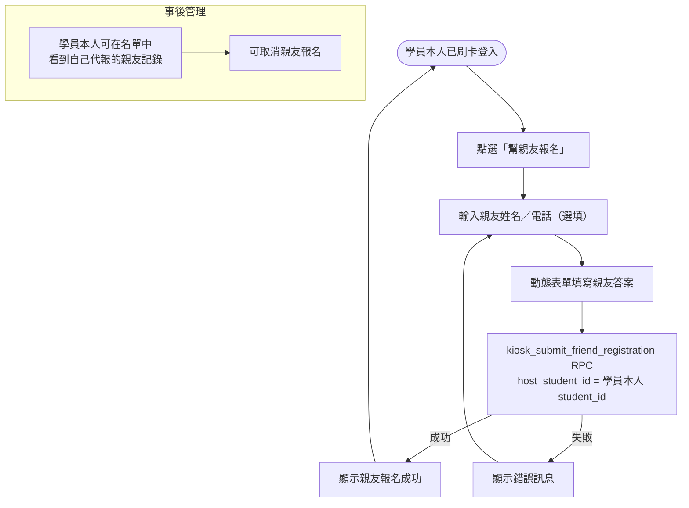
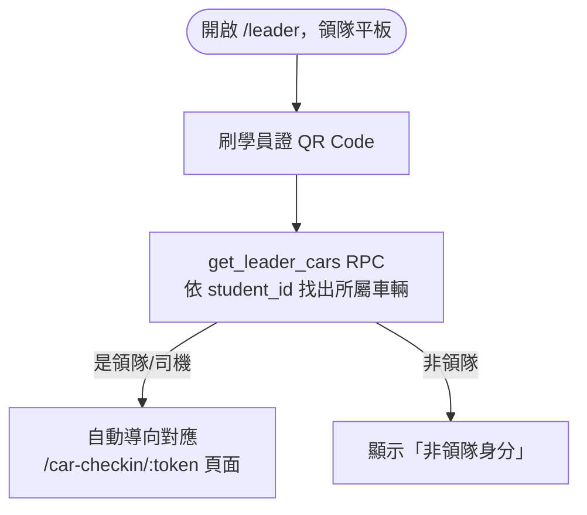
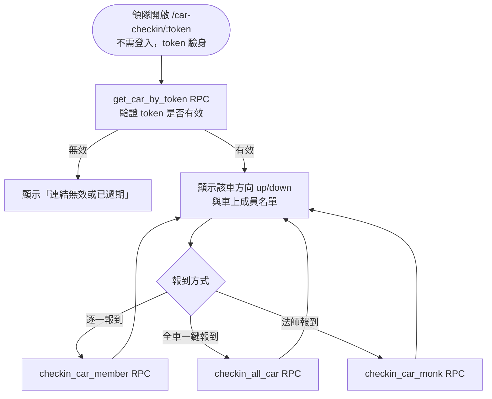
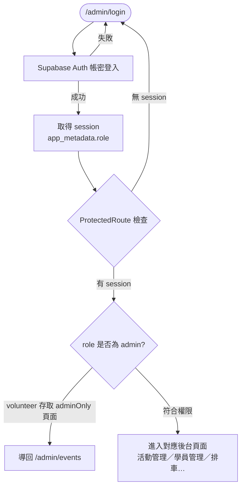
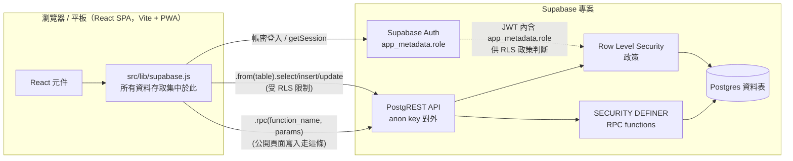
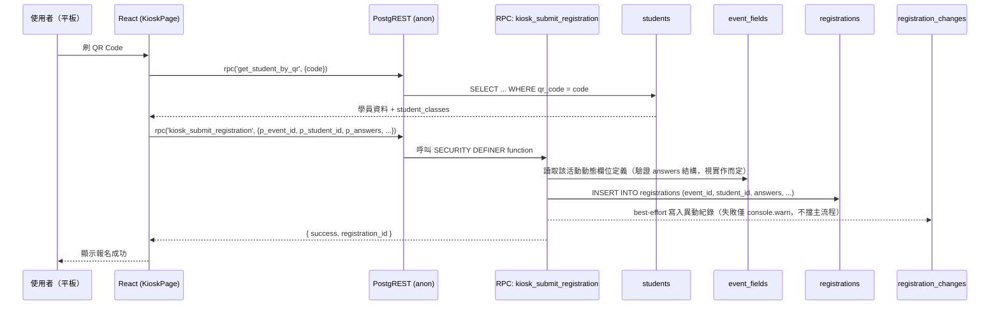
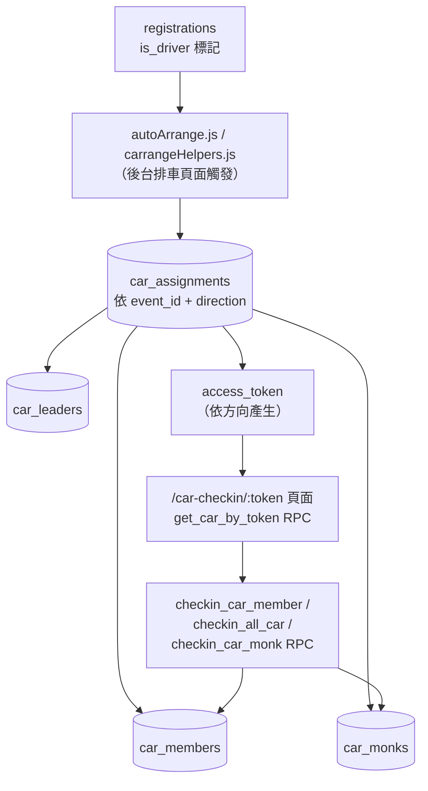

# 普宜精舍報名系統 — 流程圖

> 本文件包含兩類圖表：**操作流程圖**（使用者在各頁面的操作路徑）與
> **資料流程圖**（資料在前端／Supabase RPC／資料表之間如何流動）。
> 圖表使用 [Mermaid](https://mermaid.js.org/) 語法，可在 GitHub、VS Code（含 Mermaid 外掛）
> 或任何支援 Mermaid 的 Markdown 檢視器中直接渲染。

---

## 一、操作流程圖（Operation Flow）

### 1.1 前台：學員本人刷卡報名（`/`，KioskPage）



### 1.2 前台：代報親友／訪客報名（同一 KioskPage 內的分支）



### 1.3 公開：領隊掃卡入口（`/leader`，LeaderScanPage）



### 1.4 公開：小車／遊覽車報到（`/car-checkin/:token`，CarCheckinPage）



### 1.5 後台：登入與權限判斷



### 1.6 後台：現場報到（`/admin/events/:id/checkin`，CheckinPage）

```mermaid
flowchart TD
    A([進入活動報到頁]) --> B[刷學員證 QR 或搜尋姓名]
    B --> C[比對 registrations 名單]
    C -- 已報名 --> D[標記報到 update registrations.checked_in]
    C -- 未報名 --> E[提示「未報名」／可現場新增(walk-in)]
    D --> A
    E --> A
```

---

## 二、資料流程圖（Data Flow）

### 2.1 整體架構：無後端，前端直連 Supabase



**安全邊界說明**：anon key 是公開寫在前端打包檔裡的，因此：
- 公開頁面（kiosk 報名／編輯／取消、車輛報到、領隊掃卡）的所有寫入，一律呼叫 `RPC`（`SECURITY DEFINER`），不直接對 `registrations` / `students` 做 `.insert()/.update()`。
- 後台頁面（已登入）的讀寫則由 `RLS` 政策依 `auth.jwt()->'app_metadata'->>'role'` 判斷是否放行。

### 2.2 報名寫入的資料流（以學員本人報名為例）



### 2.3 排車系統資料流



### 2.4 動態欄位／活動模板資料流

```mermaid
flowchart TD
    A[(event_templates)] -- "後台：套用模板" --> B[(event_fields)]
    C[後台 EventDetailPage\n手動增修欄位] --> B
    B -- "JSON 欄位 schema" --> D["DynamicForm.jsx\n依 field_type 動態產生表單\n(radio/checkbox/boolean/text/plate/datetime/date/time)"]
    D --> E[使用者填寫 answers JSONB]
    E --> F[(registrations.answers)]

    G[(event_sessions)] --> H[(event_session_fields)]
    H --> D
    G --> I[(registration_session_checkins)\n多場次報到記錄]
```

---

## 三、圖例對照（快速索引）

| 縮寫／代號 | 對應內容 |
|---|---|
| anon key | 前端打包檔內公開的 Supabase 金鑰，僅能透過 RLS/RPC 限定的方式存取資料 |
| RLS | Row Level Security，Postgres 資料列層級權限政策 |
| RPC | 透過 `supabase.rpc(...)` 呼叫的 `SECURITY DEFINER` Postgres function |
| app_metadata.role | 存於 `auth.users.raw_app_meta_data`，僅管理員可修改，決定 `admin` / `volunteer` |
| kiosk_* | 前台（anon，未登入）可呼叫的 RPC，命名前綴 |
| checkin_* / get_car_by_token / get_leader_cars | 排車報到相關 RPC |

> 對應的路由與領域模型細節請見 `CLAUDE.md`；SQL 遷移檔案順序請見 `sql/MIGRATION_ORDER.md`。
